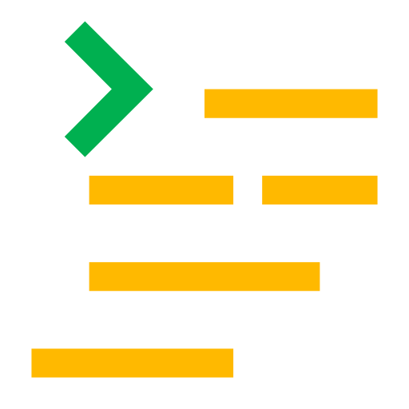

<!-- ================== Greeting ================== -->
# Zdravíčko! 
This README is also available in my native language. This link will take you there 🛫 [Very not obvious link](README.sk.md) 🐦

<!-- ================== Description ================== -->
##  About me
I'm **Marek Sýkorka** a "Junior" Associate Software Developer at [VONSCH s.r.o.](https://www.vonsch.sk/?lang=en), a company that specializes in the field of   industrial and power electronics. I've lately graduated 🎓 from [Slovak University of Technology, Faculty of Electrical Engineering and Information Technology](https://www.fei.stuba.sk/english.html?page_id=793) in the field of [Robotics and Cybernetics](https://urk.fei.stuba.sk/) with a Bachelors degree. I'm continuing to study for an engineering degree and possibly further 🙃.

That's probably the reason why most of my repositories are school project related. I want to use GitHub for my personal projects and experimentation; however, I haven't had much time recently. Until then, have a blast with some of my overengineered school projects. 😉 Oh and if it wasn't clear I'm from Slovakia.

<!-- ================== Tech Stack ================== -->
##  Languages & Tools

<!-- ================== Code editors ================== -->

  

      <strong> Code editors (All) </strong> 
       (click to expand) 
  

   
    
> 
> 
> 
> 
> 
> 

<!-- ================== Desktop applications ================== -->

  

      <strong> Desktop applications </strong> 
       (click to expand) 
  

   
    
> 
> 
> 
> 
> 

<!-- ================== Embedded systems ================== -->

  

      <strong> Embedded systems </strong> 
       (click to expand) 
  

   
    
> 
> 
> 

<!-- ================== Robotics ================== -->

  

      <strong> Robotics </strong> 
       (click to expand) 
  

   

> 
> 
> 
> 
> 
> 
> 
> 

<!-- ================== Simulations ================== -->

  

      <strong> Simulations </strong> 
       (click to expand) 
  

   

> 

<!-- ================== Microcontrollers & IoT ================== -->

  

      <strong> Microcontrollers & IoT </strong> 
       (click to expand) 
  

   

> 
> 

<!-- ================== Version control systems ================== -->

  

      <strong> Version control systems </strong> 
       (click to expand) 
  

   

> 
> 

<!-- ================== Other ================== -->

  

      <strong> Other </strong> 
       (click to expand) 
  

   

<!-- ================== Git Stats ================== -->

## 📈 Git Stats

