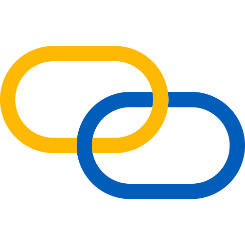

<!-- ================== Greeting ================== -->
<!-- Profile Views are from: https://github.com/antonkomarev/github-profile-views-counter -->
# Zdravíčko! 
 README si môžeš pozrieť aj v jeho anglickej verzii. Tento odkaz ťa naň presmeruje 🛫 [Nenápadný link](README.md) 🐦

<!-- ================== Description ================== -->
##  O mne
Volám sa **Marek Sýkorka** a som "brigádnik" na pozícii Softvérového vývojára v spoločnosti [VONSCH s.r.o.](https://www.vonsch.sk/), ktorá sa zaoberá oblasťou priemyselnej a výkonovej elektroniky. Nedávno som úspešne ukončil 
Bakalársky stupeň vysokoškolského štúdia 🎓 na [Slovenskej Technickej Univerzite, Fakulte Elektrotechniky a Informačných Technológií](https://www.fei.stuba.sk/) v odbore [Robotika a Kybernetika](https://urk.fei.stuba.sk/). V štúdiu pokračujem Inžinierskym stupňom štúdia a možno aj ďalej 🙃.

Aj to môže byť dôvod, prečo je väčšina mojich repozitárov zameraná na školské projekty. Časom chcem začať využívať GitHub aj na osobné projekty, ale posledne som nemal na to čas. Kým ten čas príde pokochajte sa prehnane spracovanými školskými projektami. 😉

<!-- ================== Tech Stack ================== -->
<!-- Icons are from: https://simpleicons.org/ -->
<!-- Shield Badges: https://shields.io/ -->
##  Programovacie jazyky a nástroje

<!-- ================== Code editors ================== -->

  

      <strong> Editory kódu (Všetky) </strong> 
       (klikni pre rozbalenie) 
  

   
    
> 
> 
> 
> 
> 
> 

<!-- ================== Desktop applications ================== -->

  

      <strong> Počítačové aplikácie </strong> 
       (klikni pre rozbalenie) 
  

   
    
> 
> 
> 
> 
> 

<!-- ================== Embedded systems ================== -->

  

      <strong> Priemyselné mikrokontroléry </strong> 
       (klikni pre rozbalenie) 
  

   
    
> 
> 
> 

<!-- ================== Robotics ================== -->

  

      <strong> Robotika </strong> 
       (klikni pre rozbalenie) 
  

   

> 
> 
> 
> 
> 
> 
> 
> 

<!-- ================== Simulations ================== -->

  

      <strong> Simulácie </strong> 
       (klikni pre rozbalenie) 
  

   

> 

<!-- ================== Microcontrollers & IoT ================== -->

  

      <strong> Mikrokontroléry & IoT </strong> 
       (klikni pre rozbalenie) 
  

   

> 
> 

<!-- ================== Version control systems ================== -->

  

      <strong> Verziovacie systémy </strong> 
       (klikni pre rozbalenie) 
  

   

> 
> 

<!-- ================== Other ================== -->

  

      <strong> Ostatné </strong> 
       (klikni pre rozbalenie) 
  

   

<!-- ================== Git Stats ================== -->
<!-- Top Langs is from: https://github.com/anuraghazra/github-readme-stats -->
<!-- GitHub stats is from: https://github.com/anuraghazra/github-readme-stats -->
<!-- GitHub Streak is from: https://github-readme-streak-stats.herokuapp.com/demo/ -->

##  Git štatistiky

##  Kontakt

